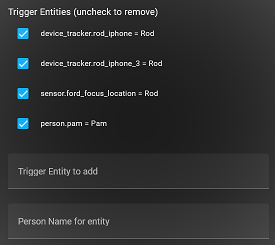
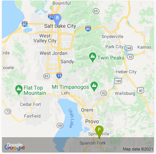
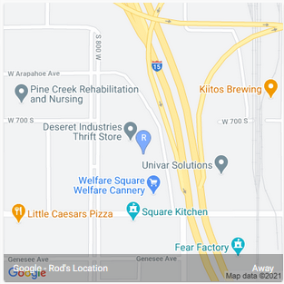
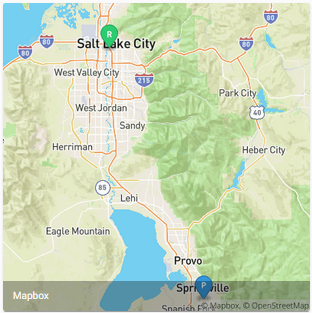
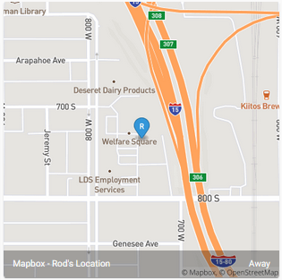
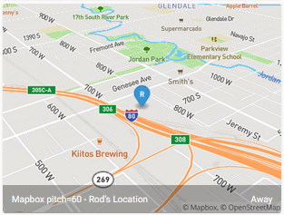
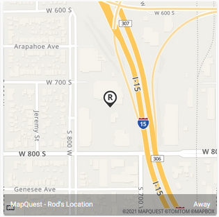
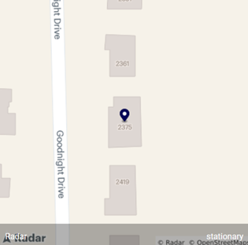
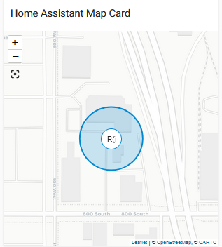

# Home Assistant Person Location Custom Integration


[](https://github.com/rodpayne/home-assistant_person_location/actions/workflows/validate.yaml)

## Table of Contents

* [Objectives](#objectives)
  * [Combine the status of multiple device trackers](#combine-the-status-of-multiple-device-trackers)
  * [Make presence detection not so binary](#make-presence-detection-not-so-binary)
  * [Reverse geocode the location and make distance calculations](#reverse-geocode-the-location-and-make-distance-calculations)
* [Components](#components)
  * [Folder: custom_components/person_location](#folder-custom_componentsperson_location)
  * [File: automation_folder/person_location_detection.yaml](#file-automation_folderperson_location_detectionyaml)
  * [Service: person_location/process_trigger](#service-person_locationprocess_trigger)
  * [Service: person_location/reverse_geocode](#service-person_locationreverse_geocode)
* [Installation](#installation)   
  * [Installation via HACS](#installation-via-hacs) 
  * [Manual installation hints](#manual-installation-hints) 
  * [Configuration parameters](#configuration-parameters) 
  * [Map Configuration Examples (Optional)](#map-configuration-examples-optional)
  * [Lovelace Examples](#lovelace-examples)
  * [Troubleshooting](#troubleshooting)
## Objectives


### **Combine the status of multiple device trackers**
This custom integration will look at all device trackers that are for a particular person and combine them into a single person location sensor, `sensor.<name>_location`. These "device trackers" can be `device_tracker`, `sensor`, `binary_sensor`, or `person` entities.  Device tracker state changes are monitored rather than doing polling, averaging the states, or calculating a probability. 
Device trackers follow devices that the person has; the person location sensor tries to follow the person instead.
<details>
  <summary> Click for More Details</summary>

For meaningful results, the device trackers should include `latitude` and `longitude` attributes, as in Mobile App, iCloud, and iCloud3 device trackers.  Most location features will be skipped for updates triggered by "device trackers" that do not know the location coordinates, but these are still useful for presence detection. 
Note that for a `binary_sensor` that indicates presence, `on` = Home and `off` = Away. 

The process for deciding which triggered device trackers to pay attention to is somewhat controversial, but here is how we do it. Each update of a "device tracker" (the trigger) is examined to decide if it should be used to update the person location sensor (the target).

* `Trigger` is the `target` itself:
  * Skip
* `Trigger` has `gps_accuracy` equal to 0 or greater than 100:
  * Skip
* `Trigger` state is `NotSet`:
  * Skip
* `Trigger` location time is before `target` location time (stale update):
  * Skip
* First `trigger` for the `target`:
  * Accept
* `Target` has `unknown` state:
  * Accept
* `Trigger` source is `GPS`:
  * `Trigger` changed zones:
    * Accept
  * `Trigger` did not change zones:
    * `Target` is not "following" a particular `trigger`:
      * Accept
    * `Target` is already following this `trigger`:
      * Accept
    * `Trigger` has the same state as the one being followed:
      * `Trigger` accuracy is better than the one being followed:
        * Accept
* `Trigger` source is not `GPS`
  * `Trigger` changed state:
    * `Trigger` implies Home and `Target` is not Home:
      * Accept
    * `Trigger` implies Away and `Target` is Home:
      * Accept
</details>

### **Make presence detection not so binary**
When a person is detected as moving between `Home` and `Away`, instead of going straight to `Home` or `Away`, it will temporarily change the person's status to `Just Arrived` or `Just Left` so that automations can be triggered or conditions applied appropriately.


*Inspired by <https://philhawthorne.com/making-home-assistants-presence-detection-not-so-binary/>*

If `CONF_SHOW_ZONE_WHEN_AWAY`, then `<Zone>` is reported instead of `Away`.                

### **Reverse geocode the location and make distance calculations**
The custom integration supplies a service to reverse geocode the location (making it human readable) using `Open Street Map`, `MapQuest`, `Google Maps`, and/or `Radar` and calculate the distance from home (miles and minutes) using `WazeRouteCalculator`.  

## Components

### **Folder: custom_components/person_location**
This folder contains the files that make up the Person Location custom integration.
<details>
  <summary>Click for More Details</summary>

* [Calculated Location Attributes](#calculated-location-attributes)
* [Open Street Map Geocoding](#open-street-map-geocoding)
* [Google Maps Geocoding](#google-maps-geocoding)
* [MapQuest Geocoding](#mapquest-geocoding)
* [Radar Geocoding](#radar-geocoding)

#### **Calculated Location Attributes**
By default, the custom integration will set the following attribute names in the sensor.

| Attribute Name            | Example | Description |
| :------------------------ | :------ | :---------- |
| compass_bearing: | 90.0 | most recent direction of travel (degrees) |
| meters_from_home: | 71862.3 | calculated distance from Home (meters) |
| miles_from_home: | 44.7     | calculated distance from Home (miles) |
| direction: | stationary     | most recent direction from Home |
| driving_miles: | 50.6       | distance from Home based on Waze route |
| driving_minutes: | 46.8     | distance from Home based on Waze traffic conditions |

*Attribution:* "Data provided by Waze App. Learn more at [Waze.com](https://www.waze.com)"

#### **Open Street Map Geocoding**
Reverse geocoding generates an address from a latitude and longitude. The Open Street Map reverse geocoding feature sets the following attribute names in the sensor.

| Attribute Name            | Example | Description |
| :------------------------ | :------ | :---------- |
| Open_Street_Map: | 1313 Mockingbird Lane Hollywood Los Angeles California 90038 United States | `display_name` from Open Street Map |
| friendly_name: | Rod (Rod's iPhone) is in Los Angeles | formatted location to be displayed for sensor |

Open Street Map (Nominatim) has [a usage policy](https://operations.osmfoundation.org/policies/nominatim/) that limits the frequency of calls. The custom integration attempts to limit calls to less than once per second.  To meet the requirement to be able to switch off the service, the state of `person_location.person_location_api` can be changed to `Off`. This can be done by calling service `person_location.geocode_api_off` and then resumed later by calling service `person_location.geocode_api_on`.  The number of calls is also reduced by skipping updates while the person location sensor state is `Home` or if the location has changed by less than 10 meters.  (It *will* update while the state is `Just Arrived`, so it reflects the home location while home.)

If you find problems with the OSM information results, feel free to sign up at https://www.openstreetmap.org/ and edit the map. 

*Attribution:* "Data © OpenStreetMap contributors, ODbL 1.0. https://osm.org/copyright"

#### **Google Maps Geocoding**
The Google Maps Geocoding feature sets the following attribute names in the sensor.

| Attribute Name            | Example | Description |
| :------------------------ | :------ | :---------- |
| Google_Maps: | 1313 Mockingbird Ln, Los Angeles, CA 90038, USA | `formatted_address` from Google Maps |
| friendly_name: | Rod (Rod's iPhone) is in Los Angeles | formatted location to be displayed for sensor |

*Attribution:* 

#### **MapQuest Geocoding**
The MapQuest Reverse Geocoding feature sets the following attribute names in the sensor.

| Attribute Name            | Example | Description |
| :------------------------ | :------ | :---------- |
| MapQuest: | 1313 Mockingbird Ln, Los Angeles, CA 90038-9436 | constructed from MapQuest location attributes. |
| friendly_name: | Rod (Rod's iPhone) is in Los Angeles | formatted location to be displayed for sensor |

*Attribution:* © 2021 MapQuest, Inc.

#### **Radar Geocoding**
The Radar Geocoding feature sets the following attribute names in the sensor.

| Attribute Name            | Example | Description |
| :------------------------ | :------ | :---------- |
| Radar: | 1313 Mockingbird Ln, Los Angeles, CA 90038, US | `formatted_address` from Radar reverse geocoding API |
| friendly_name: | Rod (Rod's iPhone) is in Los Angeles | formatted location to be displayed for sensor |

*Attribution:* powered by Radar

</details>

### **File: automation_folder/person_location_detection.yaml**
This automation file contains example automations that call the `person_location/process_trigger` service.  This is one of the ways to specify which device trackers will be watched for events that will trigger processing.  These automations are optional and are kind of a non-standard way to configure the integration.
<details>
  <summary> Click for More Details</summary>

Automation `Person Location Update` contains a list of device tracker entities to be monitored. Automation `Person Location Device Tracker Updated` looks at all `state_changed` events to find the ones that belong to device trackers. One automation or the other (or both) can be used to select the input for the process.

Note that `Person Location Update for router home` and `Person Location Update for router not_home` are not currently used by me because it drives my router crazy to be probed all the time.  The intention here was to give a five minute delay before declaring the device not home, so that temporary WIFI dropoffs do not cause inappropriate actions.

#### **Device tracker requirements (input)**
Each device tracker that is processed (by calling the `person_location/process_trigger` service) needs to have the identity of the person that is being tracked. This is specified in either a `person_name` or `account_name` attribute of the device tracker. This could be done in Configuration Customizations.


In the case of the [Apple iCloud integration](https://www.home-assistant.io/integrations/icloud/), the account_name can be specified in its configuration and this gets passed thru to the device trackers:
```yaml
# Example configuration.yaml entry for iCloud presence

- platform: icloud
  username: roderickhpayne@gmail.com
  password: !secret icloud_rod
  account_name: rod
```
</details>

### **Service: person_location/process_trigger** 
This is the service that is called by automation `Person Location Update` following a state change of a device tracker such as a phone, watch, or car.  It creates/updates a Home Assistant sensor named `sensor.<personName>_location`.  The configuration can also specify that this be done for all `person` entities and/or for selected "device trackers".
<details>
  <summary>Click for More Details</summary>	

```yaml	
Input:
  - Parameters for the call:
      entity_id
      from_state
      to_state
  - Attributes of entity_id (supplied by device_tracker process):
      last_located (optional, from iCloud3)
      latitude
      longitude
      person_name (if different from what is implied by entity_id = device_tracker.<person_name>_whatever)
      altitude (optional, passed thru to the output sensor)
      entity_picture (optional, passed thru to the output sensor)
      gps_accuracy (optional)
      source_type (optional)
      vertical_accuracy (optional)
      zone (optional)
```
The sensor will be updated with a state such as `Just Arrived`, `Home`, `Just Left`, `Away`, or `Extended Away`.  In addition, selected attributes from the triggered device tracker will be copied to the sensor.  Attributes `source` (the triggering entity ID), `reported_state` (the state reported by the device tracker), `icon` (for the current zone), and `friendly_name` (the status of the person) will be updated.
	
Note that the person location sensor state is triggered by state changes such as a device changing zones, that way a phone left at home does not get a vote for "home".  The assumption is that if the device is moving, then the person has it.  An effort is also made to show more respect to devices with a higher GPS accuracy.  This typically results in the mobile app being followed.

The built-in `Person` integration competes somewhat in combining the status of multiple device trackers.  I expect that its ability to determine the actual presence and location of a person will improve with time.  If you prefer the selection priority that the built-in Person integration provides, only call the `person_location/process_trigger` service for changes of the `person.<personName>` entity rather than the upstream device trackers.  Do not mix the two because it is likely to double the updates and may get stuck following the wrong entity.  You could follow all configured Person entities by skipping all calls to `person_location/process_trigger` and selecting the `follow_person_integration` configuration option.

#### **Person location sensor example (output)**

| Entity              | State | Attribute Name | Example         | Description |
| :------------------ | :---: | :------------- | :-------------- | :---------- |
| sensor.rod_location | Home	| source_type:   | gps | `source_type` copied from device tracker |
|                     |       | latitude:      | xx.136566162109375 | `latitude` copied from device tracker |
| | | longitude: | -xxx.60774422200406 | `longitude` copied from device tracker |
| | | gps_accuracy: | 65 | `gps_accuracy` copied from device tracker |
| | | altitude: | xxxx.1041374206543 | `altitude` copied from device tracker |
| | | vertical_accuracy: | 10 | `vertical_accuracy` copied from device tracker |
| | | friendly_name: | Rod (Rod's iPhone) is Home | formatted location to be displayed for sensor |
| | | source: | device_tracker.crab_apple | device tracker that triggered the state |
| | | reported_state: | Home | `state` reported by the device tracker |
| | | update_time: | 2020-12-11 17:08:52.267362 | time that the device tracker location was obtained |
| | | zone: | home | zone reported for the location or `away` if not in a zone |
| | | icon: | mdi:home | icon for the zone of the location |
</details>

### **Service: person_location/reverse_geocode** 
This is the service to reverse geocode the location in a sensor and it is called by `person_location/process_trigger`.  It could also be called by other integrations to do the same for their sensors. 
<details>
  <summary>Click for More Details</summary>

```yaml	
Input:
  - Parameters for the call:
      entity_id
      friendly_name_template (optional)
      force_update (optional)
  - Attributes of entity_id:
      - attributes supplied by another process (to provide current location):
          latitude
          longitude
          location_time (optional)
          source (optional)
```
</details>

## Installation

### **Installation via HACS**

This integration is available directly through the [Home Assistant Community Store (HACS)](https://hacs.xyz/), making installation quick and easy.

#### 🧰 Prerequisites

- Home Assistant installed and running
- HACS properly set up in your Home Assistant instance

#### 🚀 Installation Steps

1. Open **HACS** from the Home Assistant sidebar.
2. Use the search bar to find **`Person Location Reverse Geocode`**.
3. Click the repository, then click **Download**.
4. Confirm the version choice by clicking **Download**.
5. After download completes, **restart Home Assistant**.

#### 🛠️ Configuration

1. After restarting, go to **Settings > Devices & Services**.
2. Click **Add Integration**.
3. Search for brand **`Person Location`** and click **`Person Location`**.
4. Follow the setup flow, referring to the [Configuration Parameters](#configuration-parameters) section for configuration details.

### **Manual Installation Hints**
1. Copy folder `custom_components/person_location` and its contents under your `<config>` directory.

2. Optionally, copy and update file `<config>/automation_folder/presence-detection.yaml` as appropriate for your devices.  (This file may need to be placed elsewhere or merged into `<config>automation.yaml`, depending on how your configuration is organized. My Home Assistant configuration is split into [multiple folders](https://www.home-assistant.io/docs/configuration/splitting_configuration/).)

3. Restart Home Assistant.

4. Configure in Home Assistant `Settings > Devices & services` or add configuration in `<config>/configuration.yaml`.

5. Restart Home Assistant if `<config>/configuration.yaml` was updated.

### **Configuration Parameters**

The configuration can be updated in either the `Settings > Devices & services` GUI or by adding parameters to `configutation.yaml`. To avoid confusion and prevent unexpected results, choose to use one or the other, not both.

| GUI Parameter | YAML Parameter | Optional | Description | Default |
| :------------ | :------------- | :------: | :---------- | :------ |
| **Section:** |**Geocode API keys, region, language** |
| Google Language | `language` | Yes | Language parameter for the Google API. | `en`
| Google Country Code | `region` | Yes | Region parameter for the Google API. | `US`
| Google API Key | `google_api_key` | Yes | Google API Key obtained from the [Google Maps Platform](https://cloud.google.com/maps-platform#get-started). | Do not do the Google reverse geocoding.
| Mapbox Access Token | `mapbox_api_key`    | Yes | Mapbox Access Token obtained from the [Mapbox Account page](https://account.mapbox.com/). (Sign up for a free "hobbyist" account.)| Do not use MapBox to generate maps.
| MapQuest API Key | `mapquest_api_key`    | Yes | MapQuest API Key obtained from the [MapQuest Developer site](https://developer.mapquest.com/user/me/apps). | Do not do the MapQuest reverse geocoding.
| OSM API Key (your eMail Address) | `osm_api_key`    | Yes | Contact email address to be used by the Open Street Map API. | Do not do the OSM reverse geocoding.
| Radar API Key (publishable) | `radar_api_key`    | Yes | Publishable client API key obtained from the [Radar.com site](https://radar.com). | Do not do the Radar reverse geocoding.
| **Section:** |**Sensors to be created** |
| Sensors to be created | `create_sensors`  | Yes | List of attributes for which individual sensors are to be created so that template sensors do not need to be configured.  Choose from this list: `altitude`, `bread_crumbs`, `direction`, `driving_miles`, `driving_minutes`, `geocoded`, `latitude`, `longitude`, `meters_from_home`, `miles_from_home`. | None
| Platform for output sensor | `platform`       | Yes | Platform used for the person location "sensor". (Experimental.) | `sensor` as in `sensor.<name>_location`.
| **Section:** |**Manage triggers/devices** |
| Follow Person Integration? | `follow_person_integration` | Yes | Follow updates of all Person entities rather than looking at individual device trackers. | False
| Person Location Triggers | `person_names` | Yes | List of person names and devices to be followed.  (See example in More Details.) | None
| Trigger Entity | person_names: devices | Yes
| Person Name | person_names: name | Yes
| **Section:** |**Manage map camera providers** |
| Map Camera Name | camera: name | Yes | Name to be given to the entity in the camera domain. | None |
| Map Camera State | camera: state | Yes | Template to format a state for the entity.
| Map Camera URL | camera: still_image_url | Yes | Template to format a URL to retrieve an image from the map provider.
| **Section:** |**Options** <sup>*</sup>|
| Hours Extended Away<sup>*</sup> | `extended_away`  | Yes | Number of **hours** before changing `Away` into `Extended Away`. Set to `0` to not use `Extended Away` state. | `48`
| Minutes Just Arrived<sup>*</sup> | `just_arrived`   | Yes | Number of **minutes** before changing `Just Arrived` into `Home`. Set to `0` to not use `Just Arrived` state. | `3`
| Minutes Just Left<sup>*</sup> | `just_left`      | Yes | Number of **minutes** before changing `Just Left` into `Away`. Set to `0` to not use `Just Left` state. | `3`
| Show zone when away?<sup>*</sup> | `show_zone_when_away` | Yes | Show the state as the zone name when it is available, rather than just `Away`.| False |
| Friendly Name Template<sup>*</sup> | `friendly_name_template` | Yes | A template that specifies how the `friendly_name` of the sensor is formatted. See the note concerning template variables in More Details below. | The original format: `{{person_name}} ({{source.attributes.friendly_name}}) {{friendly_name_location}}` |

`*` Located in the options flow (activated by clicking ` ⚙ Configure`). All others are located in the configuration flow (activated when adding the integration or by clicking ` ⋮ → Reconfigure`)
<details>
  <summary>Click for More Details</summary>

  ```yaml
# Example configuration.yaml entry
person_location:
    person_names:
      - name: Rod
        devices:
          - device_tracker.rod_iphone
          - device_tracker.rod_iphone_3
          - sensor.ford_focus_location
      - name: Pam
        devices: person.pam
```


In this example, `sensor.rod_location` will reflect changes detected in three devices; `sensor.pam_location` will reflect changes in the `person.pam` entity.

* [Open Street Map Geocoding Configuration](#open-street-map-geocoding-configuration)
* [Google Maps Geocoding Configuration](#google-maps-geocoding-configuration)
* [MapQuest Geocoding Configuration](#mapquest-geocoding-configuration)
* [Radar Geocoding Configuration](#radar-geocoding-configuration)
* [A note about iCloud3](#a-note-about-icloud3)

#### **Open Street Map Geocoding Configuration**
To activate the custom integration with the Open Street Map reverse geocoding feature, add a contact email address to `<config>/configuration.yaml`.
Open Street Map is free and you do not need to sign up for an API key, so this may be a good place to start.
```yaml
# Example configuration.yaml entry
person_location:
    osm_api_key: !secret gmail_address
```

#### **Google Maps Geocoding Configuration**
To activate the custom integration with the Google Maps Geocoding feature, add a Google API Key to `<config>/configuration.yaml`. A Google API Key can be obtained from the [Google Maps Platform site](https://cloud.google.com/maps-platform#get-started). Unfortunately, obtaining a Key requires that billing be set up. Their free tier is generous for our purposes, but if it gives you the heebie-jeebies to give Google a credit card, stick with Open Street Map.
```yaml
# Example configuration.yaml entry
person_location:
    google_api_key: !secret google_api_key
```

#### **MapQuest Geocoding Configuration**
To activate the custom integration with the MapQuest Reverse Geocode feature, add a MapQuest API Key to `<config>/configuration.yaml`. A MapQuest API Key can be obtained from the [MapQuest Developer site](https://developer.mapquest.com/user/me/apps).
```yaml
# Example configuration.yaml entry
person_location:
    mapquest_api_key: !secret mapquest_api_key
```
#### **Radar Geocoding Configuration**
To activate the custom integration with the Radar reverse geocode feature, add a Radar API Key to `<config>/configuration.yaml`. A Radar API Key can be obtained from the [Radar.com site](https://radar.com). Use the Live Publishable (client) API key.
```yaml
# Example configuration.yaml entry
person_location:
    radar_api_key: !secret radar_api_key
```


#### **Friendly Name Template Variables**
| Example Variable | Description | Sample |
| :--------------- | :---------- | ------ |
| `friendly_name_location` | The zone or locality that was determined. | "is Away", "is at Walmart", "is in Peoria". |
| `person_name` | The person's name from the configuration. | "Rod" |
| `source.attributes.friendly_name` | The `friendly_name` of the device tracker that triggered the update. | "Rod's iPhone App" |
| `target.attributes.reported_state` | The `reported_state` recorded in the output sensor. (The other attributes of the output sensor can be similarly referenced,)

| Example Template | Sample Result |
| :--------------- | :------------ |
| `{{ person_name }} ({{ source.attributes.friendly_name }}) {{ friendly_name_location }}` | "Rod (Rod's iPhone App) is in Peoria" |
| `{{ person_name }}` | "Rod" |
| `{{ person_name }} {{ friendly_name_location }}` | "Rod is in Peoria" |
| `{{ person_name }}'s Location` | "Rod's Location" |

#### **A note about iCloud3**
If you use the iCloud3 integration, the following setting helps with showing the zone and icon when you have an apostrophe in the zone's friendly name.
```yaml
# config_ic3.yaml
display_zone_format: fname
```
</details>


### **Configure a Switch to control Person Location API calls (optional)**

```yaml
# Example configuration.yaml entry

switch:
  - platform: template
    switches:
      person_location_integration:
        friendly_name: Person Location Service
        value_template: "{{ is_state('person_location.person_location_integration', 'on') }}"
        turn_on:
          service: person_location.geocode_api_on
        turn_off:
          service: person_location.geocode_api_off
        icon_template: "{{ state_attr('person_location.person_location_integration','icon') }}"
```

### **Map Configuration Examples (Optional)**

The integration provides a camera platform that can be used to provide a map image. Some knowledge of the 3rd-party mapping API is necessary to adjust these maps, so get into it only if you enjoy coding and figuring things out. The map providers each require an API key, but do not put the key into the camera configuration. Instead, pull the key from the integration using something like `&key={{google_api_key}}` in the camera configuration template.

 Here are a few examples.

#### **Google**

See https://developers.google.com/maps/documentation/maps-static/start for help.


<details>
  <summary>Click for Configuration Details</summary>

This one zooms the map to show the location of everyone.

```yaml
# Example configuration.yaml entry

camera:
  - name: combined_location_google
    platform: person_location
    still_image_url: >-
      
      
      
      
      
      
        {%- set markers = markers + '&markers=color:blue%7Csize:mid%7Clabel:' + pri_pin + '%7C' + pri_latitude + ',' + pri_longitude -%} 
      
      
      
      
      
      
        {%- set markers = markers + '&markers=color:green%7Csize:mid%7Clabel:' + sec_pin + '%7C' + sec_latitude + ',' + sec_longitude -%} 
      
      
      
      
      https://maps.googleapis.com/maps/api/staticmap?size=400x400&maptype=roadmap&visible={{home_latitude}},{{home_longitude}}{{markers}}&key={{google_api_key}}
```
```yaml
# Example ui-lovelace.yaml

    cards:
      - type: picture-entity
        entity: camera.combined_location_google
        name: Google
        show_state: false
        show_name: true
```

</details>


<details>
  <summary>Click for Configuration Details</summary>

```yaml
# Example configuration.yaml entry

camera:
  - name: rod_location_google
    platform: person_location
    still_image_url: >-
      
      
      
      
      
      
        
        
      
      https://maps.googleapis.com/maps/api/staticmap?&zoom={{zoom}}&size=400x400&maptype=roadmap&markers=color:blue%7Csize:mid%7Clabel:{{pri_pin}}%7C{{pri_latitude}},{{pri_longitude}}&key={{google_api_key}}
    state: >-
      
      {{ states(pri_entity) }}
```
```yaml
# Example ui-lovelace.yaml

    cards:
      - type: picture-entity
        entity: camera.rod_location_google
        name: Google - Rod's Location
        show_state: true
 ```

</details>

#### **Mapbox**

See https://docs.mapbox.com/api/maps/static-images/ for help.


<details>
  <summary>Click for Configuration Details</summary>

This one zooms the map to show the location of everyone. This example will show the state as either `stationary` or `motion_detected`

```yaml
# Example configuration.yaml entry

camera:
  - name: combined_location_mapbox
    platform: person_location
    still_image_url: >-
      
      
      
      
      
      
      
        
        
      
      
      
      
      
      
        
        
      
      
      
      
      
      
      
      
      
      
      
      
      
      
      https://api.mapbox.com/styles/v1/{{style}}/static/pin-s-{{sec_pin}}+2ecc71({{sec_longitude}},{{sec_latitude}}),pin-s-{{pri_pin}}+3498db({{pri_longitude}},{{pri_latitude}})/[{{min_longitude}},{{min_latitude}},{{max_longitude}},{{max_latitude}}]/400x400?logo=false&padding=60,21,14,21&access_token={{mapbox_api_key}}
    state: >-
      
      
      
      
        
      
        
      
      {{ combined_state }}
```
```yaml
# Example ui-lovelace.yaml

    cards:
      - type: picture-entity
        entity: camera.combined_location_mapbox
        name: Mapbox
        show_state: false
        show_name: true
```

</details>
 

<details>
  <summary>Click for Configuration Details</summary>

```yaml
# Example configuration.yaml entry

camera:
  - name: rod_location_mapbox
    platform: person_location
    still_image_url: >-
      
      
      
      
      
      
        None
      
          https://api.mapbox.com/styles/v1/mapbox/streets-v11/static/pin-s-{{pri_pin}}+3498db({{pri_longitude}},{{pri_latitude}})/{{pri_longitude}},{{pri_latitude}},{{zoom}}/400x400?logo=false&access_token={{mapbox_api_key}}
      
    state: >-
      
      {{ states(pri_entity) }}
```
```yaml
# Example ui-lovelace.yaml

    cards:
      - type: picture-entity
        entity: camera.rod_location_mapbox
        name: Mapbox - Rod's Location
        show_state: true
```

</details>
 

<details>
  <summary>Click for Configuration Details</summary>

This map is oriented to the individual's direction of travel.

```yaml
# Example configuration.yaml entry

camera:
  - name: rod_location_mapbox_pitched
    platform: person_location
    still_image_url: >-
      
      
      
      
      
      
      
      
        None
      
        
          https://api.mapbox.com/styles/v1/mapbox/streets-v11/static/pin-s-{{pri_pin}}+3498db({{pri_longitude}},{{pri_latitude}})/auto/400x300?logo=false&access_token={{mapbox_api_key}}
        
          https://api.mapbox.com/styles/v1/mapbox/streets-v11/static/pin-s-{{pri_pin}}+3498db({{pri_longitude}},{{pri_latitude}})/{{pri_longitude}},{{pri_latitude}},{{zoom}},{{bearing}},{{pitch}}/400x300?logo=false&access_token={{mapbox_api_key}}
        
      
    state: >-
      
      {{ states(pri_entity) }}
```
```yaml
# Example ui-lovelace.yaml

    cards:
      - type: picture-entity
        entity: camera.rod_location_mapbox_pitched
        name: Mapbox pitch=60 - Rod's Location
        show_state: true
```

</details>
 
#### **MapQuest**

See https://developer.mapquest.com/documentation/static-map-api/v5/ for help.


<details>
  <summary>Click for Configuration Details</summary>

```yaml
# Example configuration.yaml entry

camera:
  - name: rod_location_mapquest
    platform: person_location
    still_image_url: >-
      
      
      
      
      
      
        None
      
        https://www.mapquestapi.com/staticmap/v5/staticmap/map?zoom={{zoom}}&size=400,400&center={{pri_latitude}},{{pri_longitude}}&locations={{pri_latitude}},{{pri_longitude}}|marker-{{pri_pin}}&key={{mapquest_api_key}}
      
    state: >-
      
      {{ states(pri_entity) }}
```
```yaml
# Example ui-lovelace.yaml

    cards:
      - type: picture-entity
        entity: camera.rod_location_mapquest
        name: MapQuest - Rod's Location
        show_state: true
```
</details>

#### **Radar**

See https://radar.com/documentation/maps/static-maps for help.


<details>
  <summary>Click for Configuration Details</summary>

```yaml
# Example configuration.yaml entry

camera:
  - name: combined_location_radar
    platform: person_location
    still_image_url: >-
      
      
      
      
      
      
      
        
        
      
      
      
      
      
      
        
        
      
      
      https://api.radar.io/maps/static?width=400&height=400&style={{style}}&markers=size:small|{{home_latitude}},{{home_longitude}}|{{sec_latitude}},{{sec_longitude}}|{{pri_latitude}},{{pri_longitude}}&publishableKey={{radar_api_key}}
    state: >-
      
      
      
      
        
      
        
      
      {{ combined_state }}
```
```yaml
# Example ui-lovelace.yaml

    cards:
      - type: picture-entity
        entity: camera.combined_location_radar
        name: Radar
        show_state: true
        show_name: true
```
</details>

#### **Map Card**

The map card requires no knowledge of the mapping API's but is limited in how much it can be customized.

See https://www.home-assistant.io/lovelace/map/ for help.


<details>
  <summary>Click for Configuration Details</summary>

```yaml
# Example ui-lovelace.yaml

    cards:
      - type: map
        entities:
          - sensor.rod_location
          - zone.home
        aspect_ratio: 4x4
        default_zoom: 17
        title: Home Assistant Map Card
```

</details>
 
### **Lovelace Examples**

Show status of the Person Location Integration and allow control of API calls.

```yaml
# Example ui-lovelace.yaml

    cards:
# ------------------------------------------------------
      - title: Home Assistant
        type: entities
        entities:
          - switch.person_location_integration
        show_header_toggle: false
# ------------------------------------------------------
```
Show all related device trackers and person location information (especially during testing).

```yaml
# Example ui-lovelace.yaml

    cards:
# ------------------------------------------------------
      - type: 'custom:vertical-stack-in-card'
        cards:
# ------------------------------------------------------
        - type: custom:auto-entities
          filter:
            include:
              - entity_id: sensor.rod_location
                options:
                  secondary_info: last-changed
              - entity_id: person.rod
                options:
                  secondary_info: last-changed
              - domain: device_tracker
                attributes:
                  person_name: 'rod'
                options:
                  secondary_info: last-changed
              - domain: sensor
                attributes:
                  person_name: 'rod'
                options:
                  secondary_info: last-changed
              - domain: binary_sensor
                attributes:
                  person_name: 'rod'
                options:
                  secondary_info: last-changed
          card:            
            title: Rod's Location Devices
            show_header_toggle: false
            type: entities
#
        - type: custom:entity-attributes-card
          heading_name: Attribute
          heading_state: Value
          filter:
            include:
              - key: sensor.rod_location.*
            exclude:
              - key: sensor.rod_location.attribution
              - key: sensor.rod_location.friendly_name            
              - key: sensor.rod_location.icon
# ------------------------------------------------------
```
### **Troubleshooting**

To enable detailed logging for this custom integration, add the following to `configuration.yaml`.
```yaml
logger:
  default: warn
  logs:
    custom_components.person_location: debug  
```
